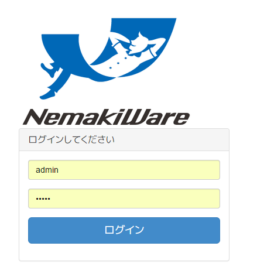

[English](https://github.com/aegif/NemakiWare/wiki/Access)/日本語
***

## 接続先

* 接続先 URL
  * Web UI クライアントの URL: `http://<servername>:<port>/ui/`  
ブラウザから利用する場合はこの URL へアクセスします。
  * CMISサーバURL  
別の CMIS クライアントや CmisSync などで URL を指定する場合は以下を利用します。
     * AtomPub形式で接続 : `http://<servername>:<port>/core/atom/bedroom`
     * JSON形式で接続 : `http://<servername>:<port>/core/browser/bedroom`

* オンライントライアルサイト
  * Web UI クライアントの URL:  `http://trial.nemakiware.com:8080/ui/` 
  * CMISサーバURL(AtomPub形式で接続): `http://trial.nemakiware.com:8080/core/atom/bedroom`
  * CMISサーバURL(JSON形式で接続): `http://trial.nemakiware.com:8080/core/browser/bedroom`

## ログイン情報
* ユーザ名: `admin`
* パスワード: ユーザ名と同じ

